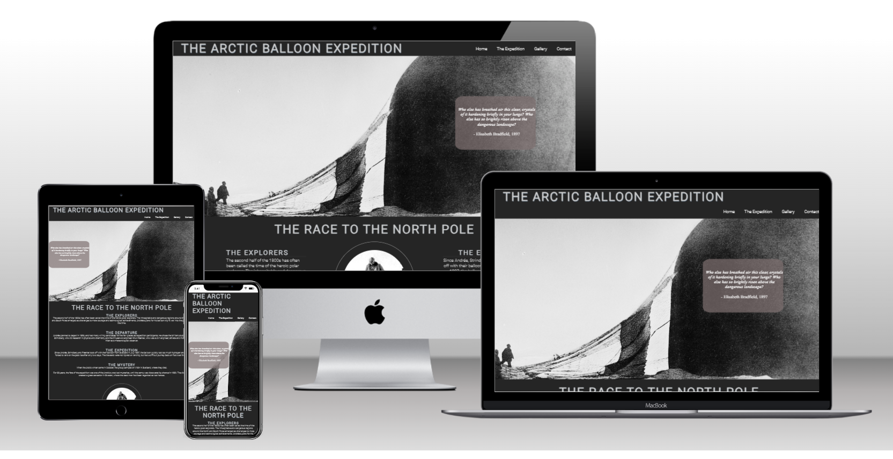
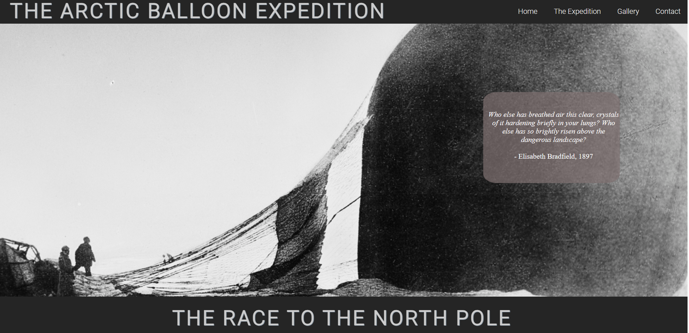
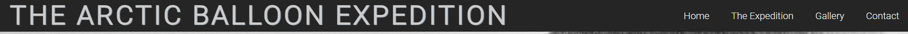
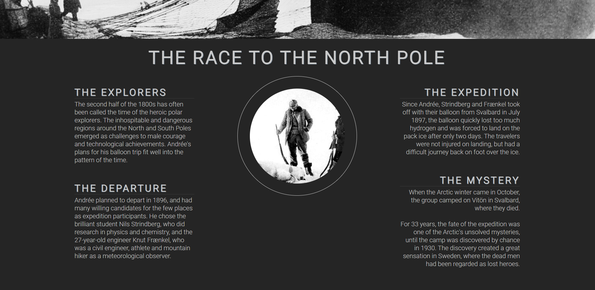
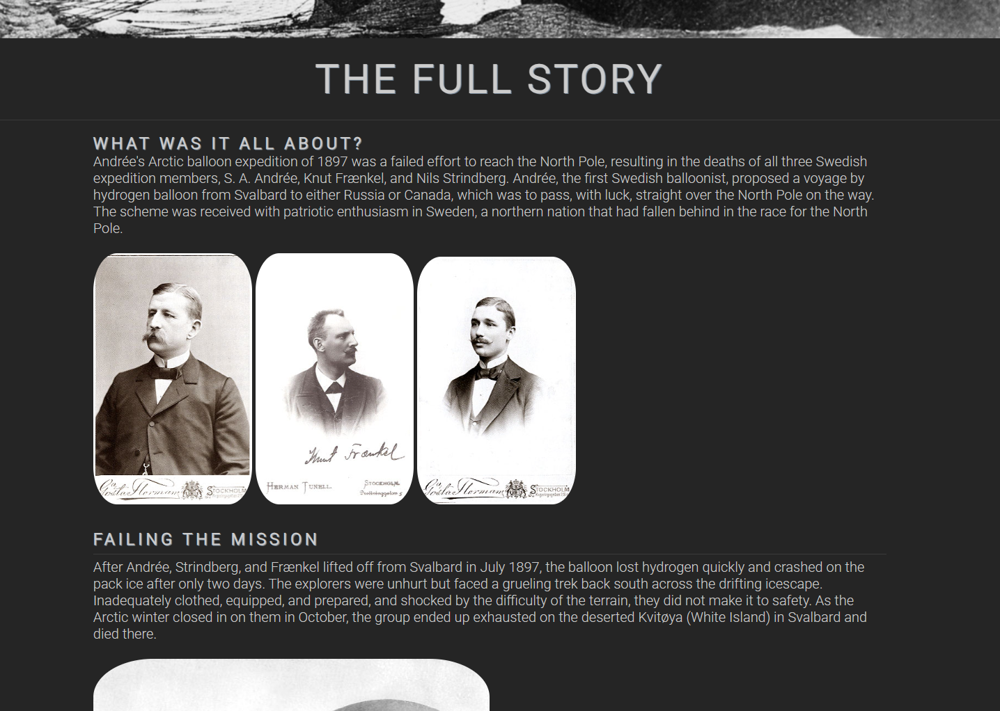
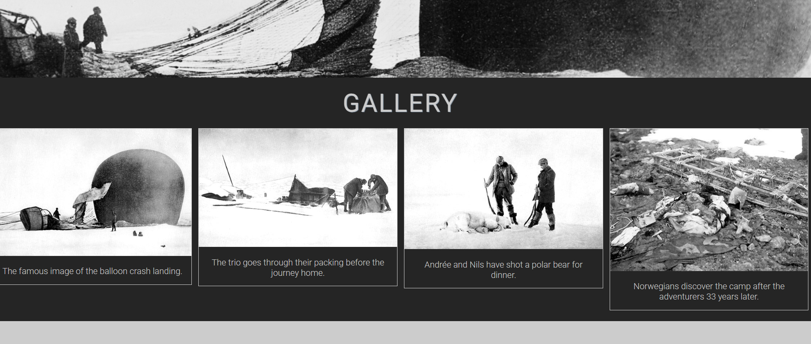
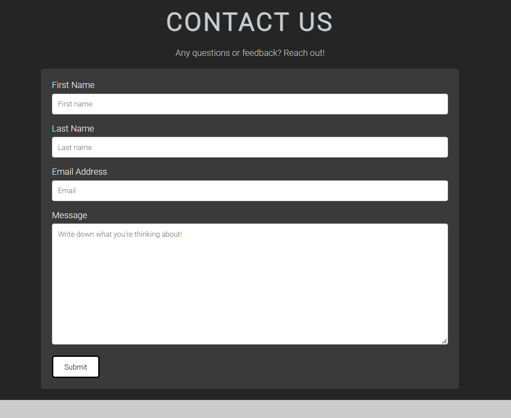
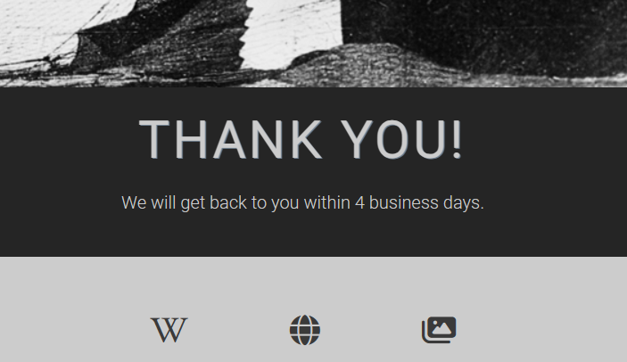
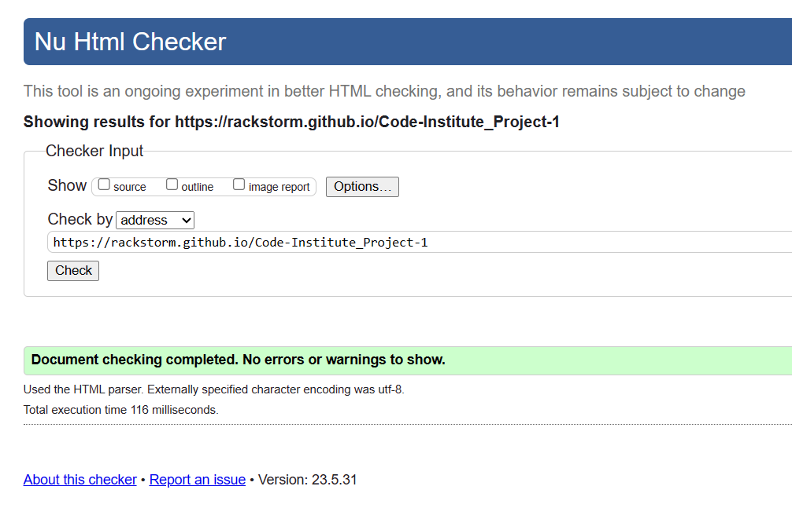
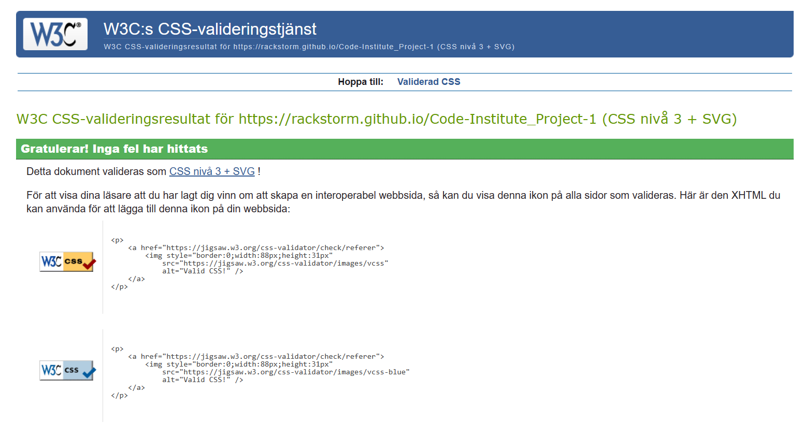

# The Arctic Ballon Expedition - A History Project

This website is intended to provide summarized overall information about the lesser-known Swedish polar expedition in 1987 for those who are into odd history facts. The intention is to be able to provide a simple website with sharp contrasts, short information that creates curiosity, simple navigation with few pages and a gallery with the images that were found upon discovery of expedition 33 years after the men from the expedition are presumed to have disappeared without a trace.

## Header

-At the top we find the most famous image from the Polar Expedition - a crashed hot air balloon to create curiosity but also to signal that this website is dedicated to something historical.

- Contains the navigation bar code.

## Navigation Bar

The navigation can be found at the top right of the logo with links to three different pages. The menu is simply constructed with a hover effect to clearly show which button you have the mouse over.

All pages have the same consistent theme, which makes it easy to see that only the content changes on the page you are on. The menu also makes it easy to navigate back and forth on the pages without having to click the back button.

## Main - Landing Page

- Brief short saummarized facts about the polar expedition to spark interest and a timeline.
- The text contains general information about the idea, people and when the events took place.
- The headings and paragraph are styled the same throughout the page to create a common thread.
- Image is used in the middle to create a inviting index page.
- The basic styling and code has been used from the [Love Running](https://github.com/Code-Institute-Solutions/love-running-2.0-sourcecode/tree/main/04-creating-the-club-ethos/05-club-ethos-icons) project.

## The Footer

- Links to more detailed information pages such as Wikipedia, but also to various pages with more images from reliable sources.
- The icons are meant to arouse curiosity and give a nice visual impression.
- All links open in a new window.

# Pages and Features

## Favicon

- Used an icon from [Icon 8]](https://icons8.com/icons)
- Favicon was created through [Favicon Converter](https://favicon.io/favicon-converter/)
- The same favicon is used throughout every single page to make it easier for the user to recognize the website if they have other tabs open.

## The Expedition

This page is for the user to be able to read more detailed information about the expedition in compact form. To break up long paragraphs, images are used to give a more relaxed visual impression.

## The Gallery

The gallery consists of a total of four images in a responsive design. The look is meant to give a retro feel with the polaroid frame and descriptive text. The images are also lined up according to the timeline with the first images showing the beginning of the project and the last image showing how the three men were discovered 33 years later after having gone missing.

## Contact Form

- The Contact page is intended to give the user an opportunity to send an email with feedback, questions or concerns about the website's content.
- Simple and direct design.
- Contains first name, last name, email and a textarea.
- All fields are required.
- When submitted the user will be sent to a different page stating the message has been received.

# Features to implement

1. Develop the CSS for the gallery and add more images.
2. Add Javascript to the contact form.
3. Improve responsiveness even further.
4. Sort out the Lighthouse issues - Cache control.

# Testing

- The website has been tested using the extension "Live Server" throughout the project.
- Dev Tools has been used to check the responsiveness in different screen sizes.
- The project has been tested in different browsers such as Chrome, IE Edge, Firefox, Safari and Opera. The only one not being able to load the page (and completely timed out) was Opera.

## Bugs

- Had minor problems with positioning of different elements due to rookie mistakes. Solved by going through Code Institutes previous videos about Positioning and reading up on [W3Schools](https://w3schools.com) about 'Display', 'Positioning' and 'Margin'.
- Had issues with GitHub not being able to show my images properly. Solved this by removing the first "/" in the file name.
- Had issues with navigation bar disappearing when changing screen resolution. Changed 'Overflow: Hidden' to 'Overflow: Visible' instead.
- Jigsaw showed 1 error consisting a faulty Float element. Sorted this out by changing it into 'margin: 0 auto;' instead.
- HTML Validator showed 1 error regarding a script. Easily fixed by putting the script inside the body-tag.

## Validator Testing

### HTML - W3C validator

No errors were returned when passing through the official [W3C validator](https://validator.w3.org/nu/?doc=https%3A%2F%2Frackstorm.github.io%2FCode-Institute_Project-1%2F) the second time.

### CSS - Jigsaw Validator

No errors were found when passing through the official [Jigsaw](https://jigsaw.w3.org/css-validator/validator?uri=https%3A%2F%2Frackstorm.github.io%2FCode-Institute_Project-1%2F&profile=css3svg&usermedium=all&warning=1&vextwarning=&lang=en) validator the second time.

# Deployment

I have used Code Institute's instructional video on how to deploy my website. I have paused the video and followed the instructions.

**The site was deployed to GitHub pages. The steps to deploy are as follows:**

1. In the GitHub repository, navigate to the Settings tab
2. From the source section drop-down menu, select the Master Branch
3. Once the master branch has been selected, the page will be automatically refreshed with a detailed ribbon display to indicate the successful deployment.
4. The live link can be found here - https://rackstorm.github.io/Code-Institute_Project-1/

# Credits

1. All informative text about the expedition come from Wikipedia.org - both Swedish and English page about the Arctic Balloon Expedition.

**Images:** https://web.archive.org/web/20070930154931/http://www.zwoje-scrolls.com/zwoje41/text08p.htm
**Text:** https://en.wikipedia.org/wiki/Andr%C3%A9e%27s_Arctic_balloon_expedition

2. CSS styling of headings, paragraphs and the image in the center comes from the Love Running project, as does the hero image code.

3. Code for gallery and nav bar were taken from W3schools with own modification.
   **Nav Bar:** https://www.w3schools.com/css/css_navbar.asp
   **Gallery:** https://www.w3schools.com/css/css_image_gallery.asp

4. Images for the gallery were taken from Wikipedia, the Swedish National Archives and a Polish history page.
   **Wikipedia:** https://en.wikipedia.org/wiki/Andr%C3%A9e%27s_Arctic_balloon_expedition
   **History page:** https://web.archive.org/web/20070930154931/http://www.zwoje-scrolls.com/zwoje41/text08p.htm
   **Swedish Digital Museum:** https://digitaltmuseum.se/

5. The icons in the footer were taken from Font Awesome. https://fontawesome.com/
6. The font was taken from Font Awesome. https://fontawesome.com/
