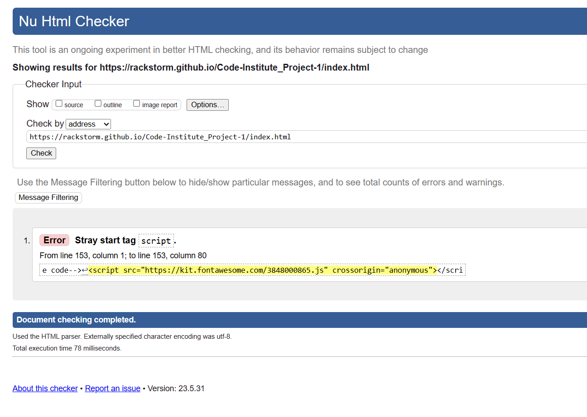
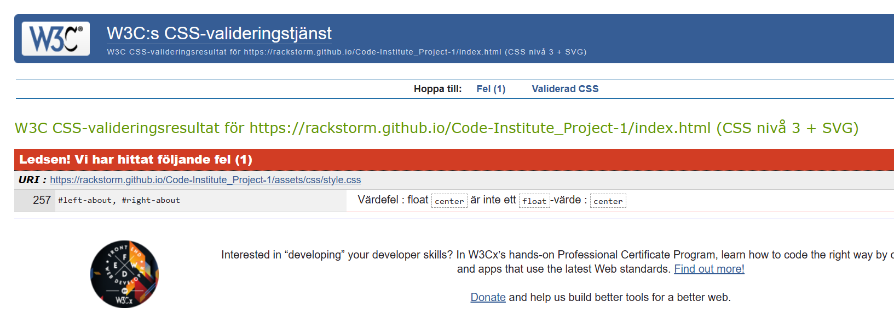

# The Arctic Ballon Expedition - A History Project

## Summary

This website is intended to provide summarized overall information about the lesser-known Swedish polar expedition in 1987 for those who are into odd history facts. The intention is to be able to provide a simple website with sharp contrasts, short information that creates curiosity, simple navigation with few pages and a gallery with the images that were found upon discovery of expedition 33 years after the men from the expedition are presumed to have disappeared without a trace.

### Header

At the top we find the most famous image from the Polar Expedition - a crashed hot air balloon in black and white. The idea with the picture is to create curiosity but also to signal that this website is dedicated to something historical.

### Navigation Bar

The navigation can be found at the top right of the logo with links to three different pages. The menu is simply constructed with a hover effect to clearly show which button you have the mouse over.

All pages have the same consistent theme, which makes it easy to see that only the content changes on the page you are on. The menu also makes it easy to navigate back and forth on the pages without having to click the back button.

### Main

In main we find content that briefly summarizes the polar expedition with headlines with short information to spark interest and a timeline. The text contains general information about the idea, people and when the events took place. The headings are cast in the same narrative form to maintain a common thread.

### The Footer

In the footer we mainly find links to more detailed information such as Wikipedia, but also to various pages with more images from reliable sources. The icons are meant to arouse curiosity and give a nice visual impression. All links open in a new window.

### The Expedition

This page is for the user to be able to read more detailed information about the expedition in compact form. To break up long paragraphs, images are used to give a more relaxed visual impression.

### The Gallery

The gallery consists of a total of four images in a responsive design. The look is meant to give a retro feel with the polaroid frame and descriptive text. The images are also lined up according to the timeline with the first images showing the beginning of the project and the last image showing how the three men were discovered 33 years later after having gone missing.

### Contact Form

The Contact page is intended to give the user an opportunity to send an email with feedback, questions or concerns about the website's content. The form is simple and direct.

When posting a message the user will automatically been sent to a different page stating the message has been received.

# Features to implement

1. Develop the CSS for the gallery and add more images.
2. Add proper function to the contact form so it's possible to use.
3. Improve responsiveness even further.

# Testing

## Live Server, Dev Tools and Mockup

Throughout the entire project, I have by using the extension "Live server" and Dev tools to see how the website takes shape and how the code expresses itself, partly in different browsers such as Chrome, IE Edge and Firefox, but also for different screen sizes. In addition to this, I have also used Mockup to get a clearer picture of how the website looks on different devices.

## Positioning

The problems I've had have mainly been about positioning - getting the header, headings and paragraphs where I want them and for them to work well in a responsive design. Partly, I have had to try my hand at Block and inline-block elements as well as Positioning and Display.

## Images

Another problem has been that the images have not been displayed correctly when I have deployed my website to GitHub. This was easily solved by changing the file name from "/assets/images/FILENAME.jpg" to "../images/FILENAME.jpg" in the code.

## Validator Testing

### HTML - W3C validator

#### First run

Showed 1 simple error.

However, this was easily fixed by putting the script inside the body-tag.

No errors were returned when passing through the official W3C validator the second time.

### CSS - Jigsaw Validator

#### First run

Showed 1 error consisting of a faulty Float element.

Changed it to margin: 0 auto; instead.

No errors were found when passing through the official (Jigsaw) validator the second time.

# Deployment

I have used Code Institute's instructional video on how to deploy my website. I have paused the video and followed the instructions.

**The site was deployed to GitHub pages. The steps to deploy are as follows:**

1. In the GitHub repository, navigate to the Settings tab
2. From the source section drop-down menu, select the Master Branch
3. Once the master branch has been selected, the page will be automatically refreshed with a detailed ribbon display to indicate the successful deployment.
4. The live link can be found here - https://rackstorm.github.io/Code-Institute_Project-1/

# Credits

1. All informative text about the expedition come from Wikipedia.org - both Swedish and English page about the Arctic Balloon Expedition.

**Images:** https://web.archive.org/web/20070930154931/http://www.zwoje-scrolls.com/zwoje41/text08p.htm
**Text:** https://en.wikipedia.org/wiki/Andr%C3%A9e%27s_Arctic_balloon_expedition

2. CSS styling of headings, paragraphs and the image in the center comes from the Love Running project, as does the hero image code.

3. Code for gallery and nav bar were taken from W3schools with own modification.
   **Nav Bar:** https://www.w3schools.com/css/css_navbar.asp
   **Gallery:** https://www.w3schools.com/css/css_image_gallery.asp

4. Images for the gallery were taken from Wikipedia, the Swedish National Archives and a Polish history page.
   **Wikipedia:** https://en.wikipedia.org/wiki/Andr%C3%A9e%27s_Arctic_balloon_expedition
   **History page:** https://web.archive.org/web/20070930154931/http://www.zwoje-scrolls.com/zwoje41/text08p.htm
   **Swedish Digital Museum:** https://digitaltmuseum.se/

5. The icons in the footer were taken from Font Awesome. https://fontawesome.com/
6. The font was taken from Font Awesome. https://fontawesome.com/
